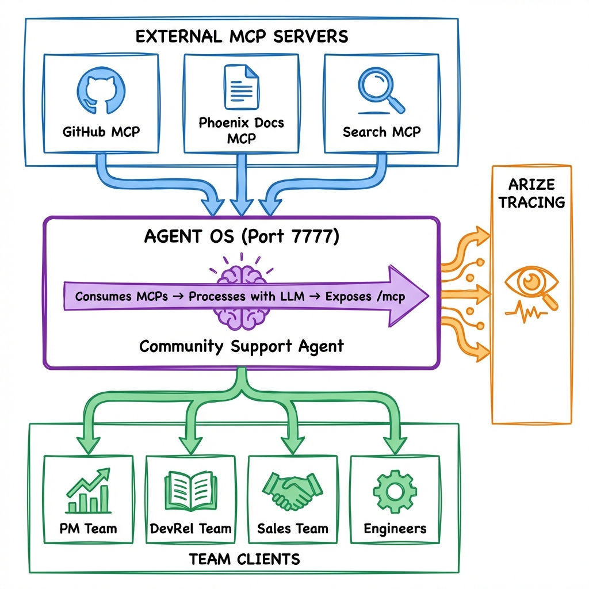

# MCP Agent OS

[](https://www.python.org/downloads/)
[](https://opensource.org/licenses/MIT)
[](https://docs.agno.com)

A production-ready MCP architecture reference implementation demonstrating how to build AI agents that consume and expose Model Context Protocol servers.

## Architecture

<p align="center">
  
</p>

This project demonstrates the **MCP chaining pattern**: an Agent OS that consumes multiple external MCP servers and exposes itself as an MCP server for downstream clients.

## Features

| Feature | Description |
|---------|-------------|
| MCP Consumer | Connects to GitHub, Phoenix Docs, and Search MCP servers |
| MCP Provider | Exposes Agent OS as an MCP endpoint at `http://localhost:7777/mcp` |
| Arize Tracing | Full observability with OpenTelemetry integration |
| Multi-Team Support | Specialized clients for PM, DevRel, Sales, and Engineering teams |
| Session Memory | SQLite-backed conversation history and summaries |

## Quick Start

### Prerequisites

- Python 3.12+
- Node.js (for npx-based MCP servers)
- Anthropic API key

### Installation

```bash
# Clone and setup
git clone https://github.com/Nancy-Chauhan/mcp-agent-os.git
cd mcp-agent-os
python3 -m venv venv && source venv/bin/activate

# Install dependencies
pip install -U agno anthropic fastapi uvicorn sqlalchemy python-dotenv
pip install arize-otel openinference-instrumentation-agno  # For tracing

# Configure environment
cp .env.example .env
# Edit .env and add your API keys
```

### Running the Server

```bash
# Simple server (Phoenix Docs only - no API keys needed)
python3 servers/simple_server.py

# Full server (GitHub + Phoenix Docs + Search)
python3 servers/main_agent_server.py
```

### Testing with Clients

```bash
python3 clients/test_client.py           # Basic connectivity test
python3 clients/pm_team_client.py        # Product insights
python3 clients/devrel_team_client.py    # Documentation gaps
python3 clients/sales_team_client.py     # Sales intelligence
python3 clients/engineers_team_client.py # Bug prioritization
```

## Configuration

### Environment Variables

| Variable | Required | Description |
|----------|----------|-------------|
| `ANTHROPIC_API_KEY` | Yes | Claude API key from [console.anthropic.com](https://console.anthropic.com) |
| `GITHUB_PERSONAL_ACCESS_TOKEN` | No | GitHub token for repository access |
| `ARIZE_API_KEY` | No | Arize tracing API key |
| `ARIZE_SPACE_ID` | No | Arize space identifier |

### MCP Servers

| Server | API Key Required | Description |
|--------|------------------|-------------|
| Phoenix Docs MCP | No | AI observability documentation |
| GitHub MCP | Yes | Repository issues, PRs, and activity |
| Search MCP | No | Web search capabilities |

## How It Works

### Server: Consuming MCP Servers

```python
from agno.tools.mcp import MCPTools

# HTTP-based MCP (no API key needed)
phoenix_mcp = MCPTools(
    transport="streamable-http",
    url="https://arizeai-433a7140.mintlify.app/mcp"
)

# Command-based MCP
github_mcp = MCPTools(
    command="npx -y @modelcontextprotocol/server-github",
    env={"GITHUB_PERSONAL_ACCESS_TOKEN": token}
)
```

### Server: Exposing as MCP

```python
from agno.os import AgentOS

agent_os = AgentOS(
    agents=[community_agent],
    enable_mcp_server=True  # Exposes /mcp endpoint
)
agent_os.serve()  # Runs on port 7777
```

### Client: Connecting to Agent OS

```python
from agno.tools.mcp import MCPTools
from agno.agent import Agent

async with MCPTools(
    transport="streamable-http",
    url="http://localhost:7777/mcp"
) as mcp_tools:
    agent = Agent(tools=[mcp_tools])
    await agent.aprint_response("Analyze community feedback")
```

## Observability

This project includes Arize AX tracing for full observability:

```python
from arize.otel import register
from openinference.instrumentation.agno import AgnoInstrumentor

tracer_provider = register(
    space_id="your-space-id",
    api_key="your-api-key",
    project_name="mcp-meetup-demo",
)
AgnoInstrumentor().instrument(tracer_provider=tracer_provider)
```

View traces at [app.arize.com](https://app.arize.com) to see agent execution flows, LLM calls, tool invocations, and error tracking.

## Project Structure

```
mcp-agent-os/
├── servers/
│   ├── main_agent_server.py   # Full Agent OS with all MCPs
│   └── simple_server.py       # Minimal setup (no API keys)
├── clients/
│   ├── test_client.py         # Basic connectivity test
│   ├── pm_team_client.py      # Product management queries
│   ├── devrel_team_client.py  # Developer relations queries
│   ├── sales_team_client.py   # Sales intelligence queries
│   └── engineers_team_client.py
├── docs/
│   └── architecture.png       # Architecture diagram
├── .env.example               # Environment template
└── README.md
```

## Resources

- [Agno Documentation](https://docs.agno.com)
- [MCP Concepts](https://docs.agno.com/concepts/tools/mcp)
- [Agent OS Guide](https://docs.agno.com/examples/agent-os)
- [Phoenix Documentation](https://arize.com/docs/phoenix)
- [Arize Tracing](https://arize.com/docs/ax)

## License

This project is licensed under the MIT License.

---

**MCP Agent OS** — Demonstrating practical MCP architecture patterns with real-world value.
